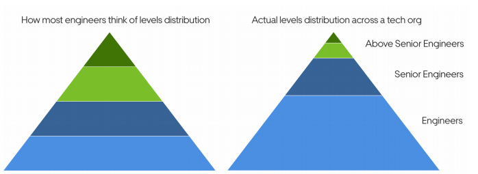

## Overview

Growing to the senior and above senior mobile engineering levels. A book for iOS and Android engineers, and mobile engineering managers.

## Growing as Mobile Engineer

If you are playing the long-game in growing as an engineer, you are wise to focus on professional and not only titles.

Mentorship is a learning relationship betwwen an experienced person and someone want to grow. Finding mentor is great to grew faster.

If you are already at a senior or above level, mentoring someone less experienced is a fantastic way for your learn.

Sometimes, the best way to grow could be changeing job/team. With change jobs, can gain a lot more:

- Better compensation
- A more prestigous title
- Expand personal network
- Learn new tech
- Learn new industry
- And many more

And sometimes, many people find job with down-levelling, with this reason:

- No real-world experices
- No enough experience
- Down level would still fit salary expectation

## Growing to Senior

Covering all engineering aspects of the platform, not just the frameworks / APIs, was key to these engineers mastering the stack. They would get to a proficient level with testing, using debugging tools, performance monitoring, crash reporting, animations, analytics, and most areas covered in the book Building Mobile Apps at Scale.

Both iOS and Android change so fast that you can never know it all. But the good news is you do not need to be familiar with every last framework! After you are proficient with the stack and have covered most parts, you can decide which areas to deep dive into. More importantly, you can decide when to turn your attention to the other stacks.

Creating the opportubity to work with other teams, not just iOS or Android, but also backend, web, data science, product and other, is something productive engineers proactively did. You do not need permission to talk with data scientists, web engineer, or any person in tech company if you would often spot an opportunity such as new project and you often start new collaborate on their own.

> A great way to grow as a mobile engineer is to not pigeonhole yourself as "mobile engineer", you start who can "and should!" wolve problems where they arise.

As a mobile engineer shipping a product that customers use, you are in a perfect spot to become a product-aware and product-minded engineer and deliver more impact. You already know the ins and outs of the user interface, and you probably work with designers and product managers. These are the very people you want to have access to, in order to become more product-aware.

This is a few tips to work well to grwo product minded muscle:

- Understand how and why your company is successful
- Build s strong relationship with your product manager
- Engage in user research, customer support, and other activities
- Bring weel-backed product suggestions to the table
- Offer product/engineering trageoffs
- Ask feedback from product manager

Proactively gathering feedback from your peers about how you can get better is a much more efficient way to grow. Here are various opportunities when you can ask for feedback and get more actionable responses, than if you simply ask your manager, "Hey, can you give me some feedback?"

Leading a project with several technologies forces you to understand how all parts work at a high level. Assuming you are an iOS engineer, you need to confirm that the Android plan makes sense and get a grip on what the backend team is doing. You could delegate all this work to the Android and backend engineers, however, that is sloppy leadership. 

You should ask for the opportunity to lead a cross-discipline project once you are proficient with your main stack and have some familiarity with the other stacks.

> If you do not ask for or talk about that promotion with your manager, do not expect to get it.

## Beyond Senior Level

When you have career ladders defined with Staff, Principal, or other Senior+ levels, figuring out how to get there is somewhat easier, as you have some reference on expectations. Career ladders can be a good starting point to discuss with your manager, evaluate yourself against, and to make a plan for how you can get there.

And if you there are no senior+, might not be as much of a blocker promotion:

- If you are the most experienced mobile engineer with senior+, ask the manager if there is a need for another level for your position.
-  If there are other engineers with “higher” titles, but the definitions are missing what those titles mean, you also want to discuss with your manager or skip-level manager about what that next level looks like, and how you can get there.

Engineers who limit themselves to any single area will more likely feel they hit a "glass ceiling" impact-wise. Senior and above engineering positions are expected to deliver outsized impact, which is often only possible when multiple engineering disciplines work together.

**Go Aboard vs Go Deep**

**Going deep** usually means doing impactful and foundational platform-like work. Deep work is typically possible at larger companies that solve mobile engineering problems that few other places can. For companies with mobile platform teams, much — if not all — of the deep work will happen in these teams. 

**Going broad** is a more obvious strategy and one I often observe among senior+ mobile engineers on product teams. These engineers become familiar with several stacks, starting with iOS and Android, but they often expand beyond this stack. They then solve problems across multiple stacks.

**Understand the business**

Forecasting key business problems in a high-growth company and starting to solve them in a scalable way is one way of going about this. Shipping complex projects with massive business impact is another way to show results that are above the typical senior scope. Getting to the senior+ level is rarely about technical skills; it is about understanding the business and driving to realize large business impact.

Here are common to understanding the business:

- One-on-one meeting with PM
- Keep in touch with key engineer from variety teams
- Mentor less experiences in organization
- have regular one-on-one with your skip level

Aim to understand the impact of a project before you start work, or get involved in one. Operating at the senior+ level always requires being strategic with your time, as there are more things you could do, than there is time in which to do them.

**Public Writing & Speaking**

The ability for software engineers to write well is an underrated skill. Public writing is a great way to achieve multiple goals at once:

- Improve your writing
- Help others
- Get feedback or ideas
- Grow your network

**Public speaking** about mobile engineering problems and solutions at conferences or meetups, is a great way to teach.

If you are above senior mobile engineer, the chances are that you are one of the most senior mobile engineers in the organization. This privilege allow you create impacts to other engineers:

1. Become a partner management
1. Sponsor other engineers
1. Educate managers on the challenges
1. Don't stop growing, no matter how "fancy" your title

## Mobile Engineering Management

Sooner or later, you are probably going to find yourself noticing engineers or teams "reinventing the wheel". As a manager, you might have more exposure to spot pain points that could be better solved with a uniform solution by building a shared framework, improving tooling, or unifying processes.

Here are suggestions for doing just that:

1. Verbalize the problems this team could solve
1. Empower engineers to think about problems, solutions, and data.
1. Get informal buy-in from your management chain and product management
1. Write a draft narrative and share it with key people
1. Get the funding
1. Don't sweat if your are not funded

**Mobile Only Career Limitations for Managers**

Being perceived as someone who can only manage mobile teams can easily limit your managerial career growth.
I firmly believe as a manager, you do yourself a favor by exposing yourself to non-mobile domains, even if your main expertise always stays as mobile. This means saying “yes” to managing non-mobile engineers, in fact, looking for this opportunity. Once you have successfully managed non-mobile teams or engineers, you will be far less likely to be perceived as a mobile-only manager.

This is many benefit if you become mobile engineering manager:

- You keep learning about engineering
- You build trust easier with other teams
- You widen you career options

Being mobile-only isn't always limiting, there are plenty of managers and technical directors who specialize and can grow their careers.

As a manager, it is your responsibility to help ensure there is a growth path for mobile engineers within your team.

## Mobile Learning at Uber base on Author