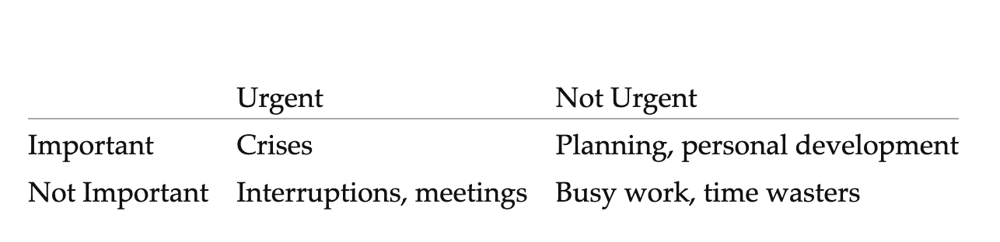

### What's an Effective Engineer? 
- They are the people who get things done. Effective Engineers produce results.

> How to Leverage Your Efforts In Software Engineering to Make a Disproportionate and Meaningful Impact, Effective Bookshelf.

## Adopt the Right Mindsets

## Chapter 1: Focus on High Leverage Activities

- Leverage = Impact Produced / Time Invested
- Use Leverage as Your Yardstick for Effectiveness
- 80% of the impact comes from 20% of the work.
- Focus on high leverage and not just easy wins.

## Chapter 2: Optimize for Learning 

Learning is a high-leverage activity due to its exponential growth. As engineers build their base of knowledge, the combination of learned skills increases the areas to which an engineer can contribute. The increased depth and breadth an engineer can contribute to making learning a high-leverage activity. An engineer should regularly invest in active learning.

- Change jobs if you have to. 
- Optimizing for learning is high leverage. 
- Adopt a growth mindset. 
  - Talk to people. Become good at telling stories. It gets better with time. 
  - Those with a growth mindset believe that they can cultivate and grow their intelligence and skills through effort.
  - Own your story.
- Invest in the rate of learning
  - Learning compounds. Compounding leads to exponential growth. Earlier the compounding starts, the better. 
  - Working on unchallenging tasks is a huge opportunity cost. You missed out on compounded learning. 
  - Prioritize learning over profitability.
  - Invest your time in activities with the highest learning rate.
- Seek Work Environments Conducive to Learning
  - Fast Growth: Companies where #problems >> #resources. Opportunity to choose high impact work.
  - Make sure you are working on high priority projects. 
  - Openness: Look for culture with curiosity, where everyone is encouraged to ask questions.
  - Fast Paced. 
  - People smarter than you.
  - Autonomy: Freedom to choose what to work on. Smaller companies => More autonomy. 
- While on Job
  - Make a daily habit of acquiring new skills.
  - Read code written by brilliant engineers. 
  - Jump fearlessly into code you don't know.
  - Always be learning. Invest in skills that are in high demand.
  - Read Books. Attend Conferences.
  - Build and maintain strong relationships.

## Chapter 3: Prioritize Regularly

- Opportunity cost of working on wrong ideas can set back growth by years.
- Prioritize tasks based on ROI.
- Regular prioritization is high leverage activity.
- On TODO Lists:
  - Maintain a 'single' todo lists where all tasks are listed. 
  - Don't try to remember stuff. Brain is bad at remembering. It's rather good at processing. 
- Ask yourself regularly: Is this the most important thing I should be working on?
- Focus on what directly produces value. 
- Learn to say no.
- Focus on the important and non-urgent.
- Find ways to get into flow. “A state of effortless concentration so deep that they lose their sense of time, of themselves, of their problems.”
- When possible, preserve larger blocks of focused time in your schedule.
- Limit the amount of Work in Progress.
  - Cost of context switching is high.
- Prioritizing is difficult. 
- Prioritization is high leverage. It has huge impact on your ability to get right things done.

## Chapter 4: Invest in Iteration Speed 
- Continuous Deployment is high leverage.
  - Will save a lot of time in manual deployment of code. They are the people who get things done. Effective Engineers produce results. 
- Move fast to learn fast.
  - Move fast and break things.
  - Moving fast enables us to build more things and learn at faster rate. 
- Invest in time saving tools.
  - If you have to do something more than twice, write a tool the third time. 
  - Tools are multipliers that allow your to scale your impact beyond the confines of a day.
  - Faster tools get used more often.
  - Faster tools can enable new workflows that previously weren't possible.
  - Productivity skyrockets with tools.
  - Time saving property of tools also scale with team adoption.
- Shorten your debugging and validation Loops.
  - Extra time spent in optimizing debugging workflow can help you fix annoying bugs with less headache.
  - Debugging is hard. It's time consuming. Upfront investments to shorten debugging loops are worth it. 
- High test coverage to reduce build and site breakages.
- Fast unit tests to encourage people to run them.
- Fast and incremental compiles and reloads to reduce development time.
- Master you programming environment.
  - One editor. One high level language. Shell. Keyboard > Mouse. Automate manual workflows. Use interactive shell. Make running specific tests easy.
- **Faster you can iterate, faster you can learn.** 

## Chapter 5: Measure what you want to Improve
- Use metric to drive progress.
  - If you can't measure it, you can't improve it.
  - Good metric. 
    - Helps you focus on right things.
    - Drives forward progress.
    - Helps you guard against future regressions. 
    - **Performance ratcheting**: Any change should strictly improve the metric.  
    - Bad metric can lead to unwanted behavior.
    - Examples: 
      - #hours worked < productivity.
      - click through rates < long click through rates.
  - Metric you choose influences your decisions and behavior.
  - Look for metric that, when optimized, maximizes impact for the team.
  - Actionable metric - Whose movement can be casually explained by team's effort.
  - Responsive metric - Updates quickly to give back feedback whether a given change was =ve or -ive.
  - Choosing a metric is high leverage.
  - Dedicate time to pick right metric. 
- Instrument everything to understand what's going on. 
  - Measure anything, measure everything. 
  - Graphite, statsd. A single line of code lets you define a new counter or timer on the fly. 
  - Measuring goals you want to achieve is high leverage.
- Internalize useful numbers.
  - Knowledge of useful numbers provide a valuable shortcut for knowing where to invest efforts to maximize gains.
  - Need upfront work. Need not be accurate, ballpark idea suffices.
  - Knowing useful numbers enables you to do back of the envelope calculations to quickly estimate the performance properties of a design without actually building it.
  - Internalizing useful number help you spot anomalies.
Be skeptical about data integrity.
 - Log data liberally.
 - Build tools to iterate on data accuracy sooner.
 - Examine data sooner.
 - When numbers look off, dig in to it sooner.
 
:heavy_check_mark: Measure your progress. Carefully choose your top-level metric. Instrument your system. Know your numbers. Prioritize data integrity. 

## Chapter 6: Validate your ideas early and often. 
- Not validating early leads to wasted efforts.
- Don't delay get feedback. 
- Find low effort ways to validate work. 
- Power of small batches. Helps you avoid making a big mistake by stopping the flow.
- Approach problem iteratively. 
- No large implementations.
- Working solo? Be wary. Be extra vocal and get feedback.

## Chapter 7: Improve project estimation skills.
- Beware of mythical man month. Communication overhead is significant. 
- Reduce risk early.
- Rewrite projects - almost always fail. 
- Additional hours hurt productivity. Causes burnout. 
- Do the riskiest task first. 
- Allow buffer room for the unknown.

## Chapter 8: Balance Quality with Pragmatism
- High code quality. Code readability.
- Establish sustainable code review process.
- Code reviews help:
  - Catch bugs and design problems early.
  - Sharing working knowledge of the codebase.
  - Increases long term agility. Easier to understand, quicker to modify. 

#### Manage complexity through Abstraction  
- Example: MapReduce.
- Right abstractions make huge difference.
- “Pick the right ones, and programming will flow naturally from design; modules will have small and simple interfaces; and new functionality will more likely fit in without extensive reorganization,”
- “Pick the wrong ones, and programming will be a series of nasty surprises: interfaces will become baroque and clumsy as they are forced to accommodate unanticipated interactions, and even the simplest of changes will be hard to make.”
- The right abstraction can increase engineering productivity by an order of magnitude. 
- Simple abstractions avoid interweaving multiple concepts, so that you can reason about them independently rather than being forced to consider them together.
- Designing good abstractions take work. 
- An abstraction's usage and popularity provides a reasonable proxy for its quality.

#### Automate Testing
- Unit test cases and some integration testing provide a scalable way of managing growing codebase.
- A suite of extensive and automated tests can reduce overall error rates by validating the quality and by safeguarding against regressions.
- Tests also allow engineers to make changes, especially large refactorings, with significantly higher confidence.
- Despite its benefits, it can be difficult to foster a culture of automated testing.
- Focus on high leverage tests. 
- Writing more tests, creating a virtuous feedback cycle and saving more development time.

#### Repay Technical Debt
- Technical debt refers to all the deferred work that’s necessary to improve the health and quality of the codebase and that would slow us down if left unaddressed.
- Accumulating technical debt is fine as far as it is repaid within time. 
- Refactor often.

## Chapter 9: Minimize Operational Burden

#### Reduce Operational Complexity
- Keep no. of technologies low. Don’t sway towards shiny new technologies.
- Every additional technology you add is is guaranteed to go wrong eventually. Will need your time. 
- Do the simple thing first.
- Embrace operational simplicity. 
- The first solution that comes to mind is generally complex. Don't stop. Keep peeling off the layers of onion. 
- Simplify the architecture to reduce their operational burden. 
- “What’s the simplest solution that can get the job done while also reducing our future operational burden?” 
- Discipline to focus on simplicity is high leverage. 

#### Fail Fast 
- Fail immediately and visibly.
- Doesn’t necessarily mean crashing your programs for users.
- fail-fast to surface issues immediately. 
- Failing fast is high leverage as it saves debugging time.

#### Relentlessly Automate
- Automating mechanics is good.
- Automating decision making - no.
- Hone your ability to respond and recover quickly.
  - Leverage recovering quickly > Leverage preventing failures.
- “script for success,” practice failure scenarios, and work on our ability to recover quickly. 
- Make batch process idempotent 
- Make processes retryable, i.e., not leaving any global state. 

## Chapter 10: Invest in your team's Growth
- Invest in onboarding.
- The higher you climb up the engineering ladder, the more your effectiveness will be measured not by your individual contributions but by your impact on the people around you.
- **"You’re a staff engineer if you’re making a whole team better than it would be otherwise. You’re a principal engineer if you’re making the whole company better than it would be otherwise. And you’re distinguished if you’re improving the industry.”** 
- Focus primarily on making everyone around you succeed.
- Your career depends on your team's success.
- Make hiring everyone's responsibility. 
- Shared ownership of code. 
  - Keep bus factor more than one. 
  - Shared ownership removes isolated silos of information.
- Build collective wisdom through post mortems.
- Invest in automated testing.
  - Automated test cases lead to higher confidence when refactoring.
  - Write test cases when the code is fresh in mind.
  - Don’t be dogmatic about 100% code coverage.
  - Value of tests increases over time and cost to write goes down. 
- Hire the best. 
- Surround yourself with great advisors

:sunny: **“Leverage is the lens through which effective engineers view their activities. ”** :sunny:

### 10 Books to read by author: 
- Peopleware Productive projects and Teams. Amazon. My Summary.
- Team Geek: A Software Developer’s Guide to Working Well with Others. (Debugging Teams) Amazon. My Summary. 
- High Output Management
- Getting Things Done: The Art of Stress-Free Productivity
- The 4-Hour Workweek: Escape 9-5, Live Anywhere, and Join the New Rich
- The 7 Habits of Highly Effective People: Powerful Lessons in Personal Change
- Conscious Business: How to Build Value Through Values
- Your Brain at Work
- Flow: The Psychology of Optimal Experience
- Succeed: How We Can Reach Our Goals
