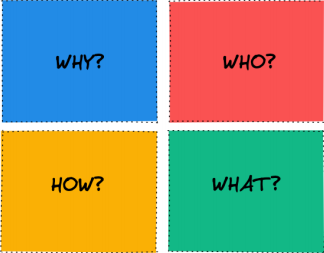
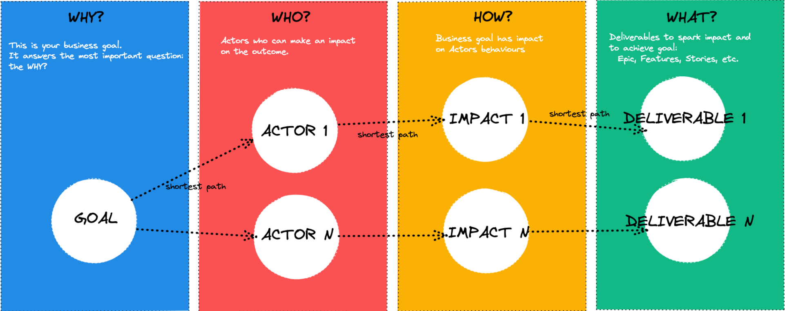

## Overview

A book that gives insight about being a software engineer with a good mindset to grow, quickly deliver a product and test it better.

## Chapter 1

> "Understanding the product from past to present and the key characteristic of a good product"

### From Past to Present

Humans have had a survival instinct since ancient times by solving problems. So, as an engineer, we need to have the ability to solve a problem as a philosophical basis.

### The Product

A product is made to solve a problem, and a product can be different ways to solve the problem. And as software engineers, we solve problems with code, but the code still serves the purpose of the product. We can't solve a problem with our code, without understanding the details of the product and its purpose.

### Conflict of Interest

The most essential of being a product minded engineer is to resolve the conflict beetween two spaces and develop high quality and reliable product. And necessary to understanding the problem space first, because people always look for the answers to the problem.

### Common Characteristic of a Well-Thought Product

Software engineering is analysing customer and business requirements and the designing, developing, build and testing sotware applications to meet those requirements.

Many software product on the market today that serve various industries. Often as developer focus on creating good product that work, but forget to consider other aspects that can make a product extradionary. So need to incorporate fundamental characteristic of a software into your software core functionality to have outstanding product.

1. **Functionality**

  Functionality refers to wheter a product works and helps the user meet their goals and needs.

2. **Usability**
  
  > "Usability us about human behaviour. It recognizes that humans are lazy, get emotional, are not interesting in putting a lot effort into, say, geting a credit card and generally prefer things that are easy to do vs those that are hard to do"
  *David McQuillen*

  Usability => how well a specific user within a particular context can use a product to achive a defined goal efftively, efficiencly, and satisfactory.
  
  In short usability, users can should to less effort to learn and use our products. And in usability depends on five basic priciples:

  - Memorability
  - Learnability
  - Efficiency
  - Satisfication
  - Errors

3. **Efficiency**
  
  The products needs to use both human and system resources are effectively and efficiencly as possible. The efficiency have 3 dimensions: Sistem Resource, Effort Customer, and Labour.

4. **Flexibility**
  
  It is essential to keep up with rapidly changing markets, technologies, and customer needs.

5. **Releability**

  A good product doesn't have to be perfect, it just has to be reliable indeed, and it should work smoothly.

6. **Maintanability**
  
  It is refer to how easky you can repair, improve and comprehend your product.

7. **Portability**

  Portability it mean product can be survive not only in local market, but in different coutries, economic, sociological or cultural factors. You may not nee dto focus on this in the early stage, but a well-thought product should not ignore portability.

8. **Integrity**

  Integrity is one of vital for demosntrating product safety, security, and maintanability. Integrity include the robust protection of sensitive information of user/customer data.

## Chapter 2

> "Understaing the Problem Space and Clarifying the Solution Space"

### How do We Solve the Problem?

#### Human Problem Solving

  About Problem solving Allen Newell and Herbert Simon recommend the classic book with strategies in their book:

  1. Categorize the problem you want to solve or find the equivalent in the existing categories
  1. Write a computer program that solves the problem in its simplest from
  1. Ensure that all stakeholders related to the problem can verbally express their ideas about the solution and include them in the solution
  1. FInd the differences or similarities of your program with the verbal solution

#### Problem Solcing is Searching a Problem Space

  > Problem solving is essentially a search through an abstract problem space. Newell & Simon

#### Problem Solving Difficulty

  The size of the problem space how strongly the task itself suggests the best space. Many problems to be problems once we have the correct procedure in memory. We need to develop memorized answers and algorithms that eliminate the need problem solving altogether.

#### What shot programs fit best?

  Productions have a few characteristic that make plausible for modelling aspect of human right:
  
  1. Their modularity means that parts what has been learn transfer to new skill.
  1. They extend the basic behaviourist notion of stimulus-response.
  1. They force serial order on human thinking.

#### How we can solve the problem better?

  Prior knowledge exerts an anormous influence on problem-solving. Consider the ways prio knowledge influences your thinking:

  - Determines your choice of problem space.
  - Determines which operators are available to you.
  - Create memories of specific pattern, reducing the analysis required.

  > Knowledge is more important than intelligence for particular classes of problems.


### The Important of Understanding the Problem

  > "if I were given one hour to save the planet, I would spend 59 minutes defining the problem and one minute resolving it" -Albert Einstein

  All words of windom are actually based ib experience. We should deeply understand and describe the problem as clearly as possible before finding and implementing the solution.
  
  We need to understand the first step in developing a good product after summarizing the characteristics of a good product.

  > "It's not that i'm so smart, it's just that I stay with problems longer" -- Albert Einstein

  That is contain assumtions, no matter how simple the problem is. Because can be no problem without assumtions, we must prioritise all assumtions and challenge them one by one to find the right solution.

  Makin the problem more minor is one way to examine a problem statement. We can make the problem smaller by breaking it into pieces or complete the problem bigger by making it more abstract.

  Before rushing to solve a problem, always look at it from different perspectives. Looking at it with different eyes is a great way to have instant insight into new, overlooked directions.

  Some language construct that always help it moer effective:

  - Assume a myriad of sulutions
  - Make ti possitive
  - Frame your problem in the form of a question

  Example: 

  ```
  In what wyas might I packer (action) my book (object) moer attractively (qualifier) so people will buy more of it (end result)?
  ```

### Clarify the Solution Space

  After fully understanding the problem, we need to clarify the solution space. We have to clarify our solution space to make a high-level design of the solution, plan you interations, and plan resources, or can able to see the distance between our and our goals more clearly.
  
  Impact mapping is a tool for product development teams to choose which featuers to prioritise by working outward from an overarching goal and then locating the big or small actions that will accomplish those goals. 

  WIth the goal at the centre of impact mapping, more time can be spant identifying and degining the goal than anything else. If you can answer the following SMART goal questions:

  - Is it **S**pecific?
  - Is it **M**easurable?
  - Is it **A**ction-oriented?
  - Is it **R**ealistic?
  - Is it **T**imely?

  And the impact mapping use framework consisting of 4 different steps (Why, Who, How, What)

  

#### The Goal: Why?
  
  This question totally represents your business goal. This the "Why" question leads us to the following thwo questions:

  1. Do you solve the right problem? and how do you know?
  1. How do you measure the success of your product/service?

  The Golder Circle consists of three layers from the "Start with a Why" book:

  1. Why - This is the core belief of the business. It's why the business exists
  1. How - This is how the business fulfils that core belief
  1. What - This is what the company does to fullfil that core belief

#### The Actors: Who?

  In the "Who" part of impact mapping, we investigate "Who can help use reach our goal?", "WHose behaviour do we want to impact?", "Who can obstruct it?". This about people with whom you don't normally collaborate, be specific as possible.

#### The Impact: How?
  
  The "How" part describe the impacts of our product/service: "How do we want to change the behaviour", "How could our actors behaviour change to help use achieve our goal?", "Which behaviour is most likely to reach our goal?". Focus on what the actors most likely would do to support us to reach our goal, not everyting they `can` do. Consider that could potentially or on pupose hinder us.

#### The Deliverables: What?

  Output are important products, services, profits, and revenues: the What outcomes create meaning, relationship, and differences: the Why output, such ad revenue and profit, enable us to fund outcomes: but without outcomes, there  is not need for outputs.

  

### Test your Solution Space with Data
  
  > "Without data, you're just another person with an opinion." - W.Edward Deming

  Data-driven decision making is the practice of collectiing data, analysing it, and basing decisions on insights derived from the information. Data-driven decisions are more objective and can be quickly evaluted according  to their impact on metrics.

  The term data-driven may seem redundant as people who make decission might already rely on data. Data0driven decision making leads to greater transparency and accountability and this approach can improve teamwork and staff engagement.

## Chapter 3

> "The key characteristics of product-oriented engineers and how to empower our competencies"

#### Start with Why

Product-minded engineers always start why, they tirelessy ask the why question and repeat it until they are satisfied. And you need want to understand the case of the problem more than the solution and they are interested in it.

#### Protest By Nature

Product minded engineers never accepts the requests of the stakeholders they work with. May be satisfied with their answer to the WHY, but never hesitate to test the solution. Most of the time, they do not accept this idea as it is and try to improve the solution.

#### Think Twice

Product minded engineers often ahve well-thought-out ideas. Take the time to understand how the business works, how the product fits in, and its goals and really case about the feelings of your customers. Straight into data about business and user metrics, getting their hands on this data however they can. And all of ideas are base on data. 

Always think twice before sharing their thought with their teammates. When their ideas are hard to sell. They try to find out why, the purpose of doing this is not arrangance and erally wanto understand the gaps in their ideas.

#### Think Outside the Box

Product minded engineer are adept at seeing the big picture, they never focus in single point do not hesitate to use their instincts to know the future, But not be forgetten the basis of their experience. Consider many open points, such as the pain points that any change will cause to customer(different market factor, competitor reaction).

#### Smooth Communicators

Product minded should solid communication with their non engineer stakeholders. And they also smooth communicatorsm making it clear they're interesetd in learning more about how toher disclines work.

#### Trade of Juggler

Product engineer have unique strengths at engineering and product perspective at the same time. They can find different and reliable solutions.

#### Always Patient

Constantly stive to improve their ideas, but they know that the right idea can only make a significant impact at the right time. Wait petiently for the right time to come, while doing this smell,market and follow the competitors.

#### Edge Case Master

Be able to predict many edge cases and address then to the right points. Sometime need enought time and energy to deal with edge cases, however it more benefical in many cases to addres them and plan them instead of wasting time and envery overcoming these edge cases. We need use time really efficiently.

#### Strike Home with Customer

They constantly worry about their users not understanding their intentions cleary. They usually have question "How can we be sure that our users will be able to use the features we have developed in the way we intended".

### Become a Product-Minded Engineer

#### Discover your company in time

You can start by learning about your business model, how your company made money
 or where it spends its money. Your intention should be to grasp the company's business model, you can research most profitable products, departments or parts.

#### Make a String Relationship with Your Product Person

You can make a strong relationship with your product person, let them mentor yo so you can have some excellent insights. 

> Chit chats are perfect for that, even you will be surprised at what you learn in this small talks.

#### Find who Ferquently Interacts with the Customer

One of the best ways to understand a product is to participate in user research, customer support and similar activities. You can clearly understand how cutsomer support and similar activities.

#### Don't be Afraid to Suggest new Ideas

You can organize brainstorming session. Never be afraid to take the initiative, if really know your business, product and other stakeholders, it's worth the risk, you can start with small suggestion for your project.

#### Talk about Tradeoffs

You can try to find your tradeoff, do not try to find only the engineering tradeoffs your project but also the tradeoffs of the product itself.

#### Feedback is Important

If Frequently ask for feedback from the product persons work with, you can quickly realize your weakness and improve your weaknesses. You can have feedback and valuable suggestion can guide you from teammates. These people who best test your ideas on this matter, as required but their role.

#### Code First vs Product First

Tech requirement should be fefine to solve problems with your product. Code first engineers are missing something very fundamental despite their good intention. User don't case about tech stack, quality of code , or many facy terms are really meaningless to them.

## Chapter 4
